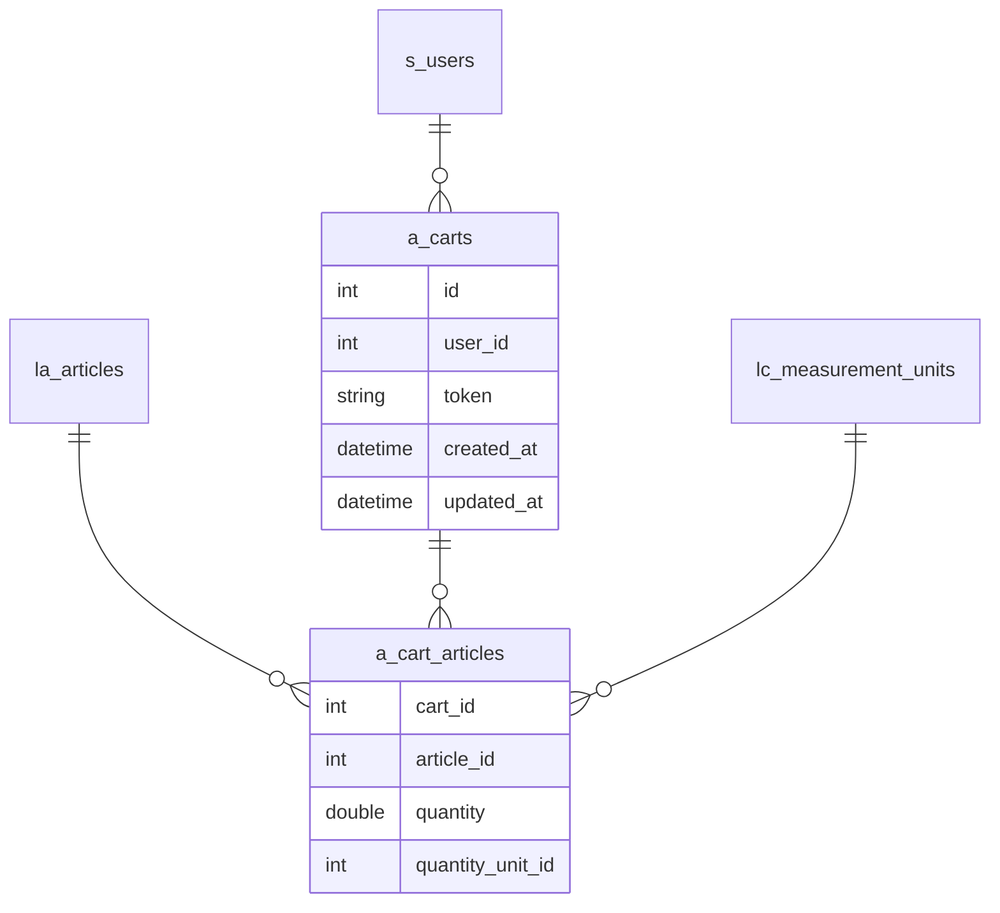

# Amethyst Database Schema

```mermaid
erDiagram
    a_cart_articles {
        int cart_id
        int article_id
        double quantity
        int quantity_unit_id
    }
    a_carts {
        int id
        int user_id
        string token
        datetime created_at
        datetime updated_at
    }
    la_articles ||--o{ a_cart_articles : ""
    a_carts ||--o{ a_cart_articles : ""
    lc_measurement_units ||--o{ a_cart_articles : ""
    s_users ||--o{ a_carts : ""

```
