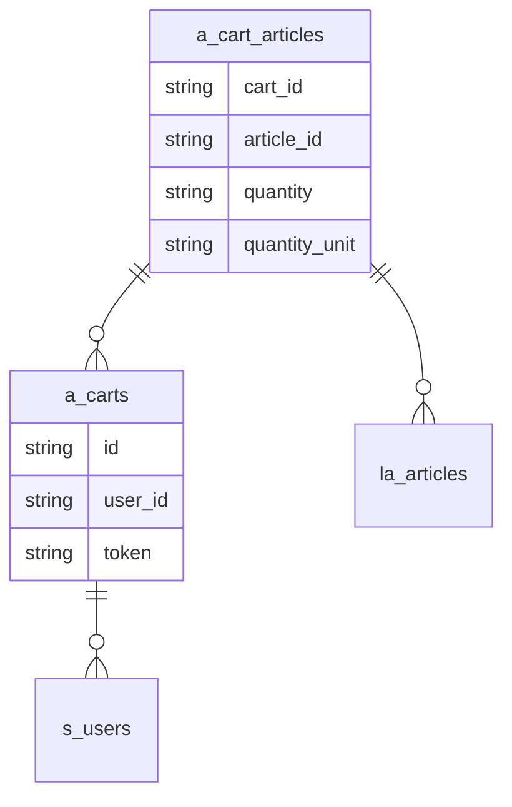

# Amethyst Database Schema

```mermaid
erDiagram
    a_carts {
        string id
        string user_id
        string token
    }
    a_cart_articles {
        string cart_id
        string article_id
        string quantity
        string quantity_unit
    }
    a_carts ||--o{ s_users : ""
    a_cart_articles ||--o{ a_carts : ""
    a_cart_articles ||--o{ la_articles : ""

```
