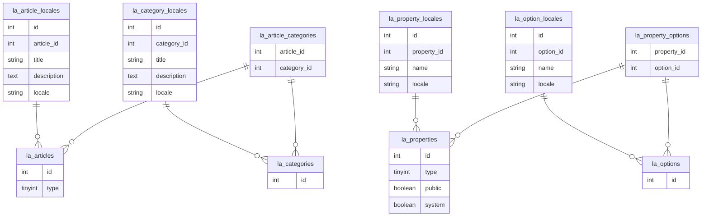

# Article Database Schema

```mermaid
erDiagram
    la_articles {
        int id
        tinyint type
    }
    la_article_locales {
        int id
        int article_id
        string title
        text description
        string locale
    }
    la_categories {
        int id
    }
    la_category_locales {
        int id
        int category_id
        string title
        text description
        string locale
    }
    la_article_categories {
        int article_id
        int category_id
    }
    la_properties {
        int id
        tinyint type
        boolean public
        boolean system
    }
    la_property_locales {
        int id
        int property_id
        string name
        string locale
    }
    la_options {
        int id
    }
    la_option_locales {
        int id
        int option_id
        string name
        string locale
    }
    la_property_options {
        int property_id
        int option_id
    }
    la_article_locales ||--o{ la_articles : ""
    la_category_locales ||--o{ la_categories : ""
    la_article_categories ||--o{ la_articles : ""
    la_article_categories ||--o{ la_categories : ""
    la_property_locales ||--o{ la_properties : ""
    la_option_locales ||--o{ la_options : ""
    la_property_options ||--o{ la_properties : ""
    la_property_options ||--o{ la_options : ""

```
