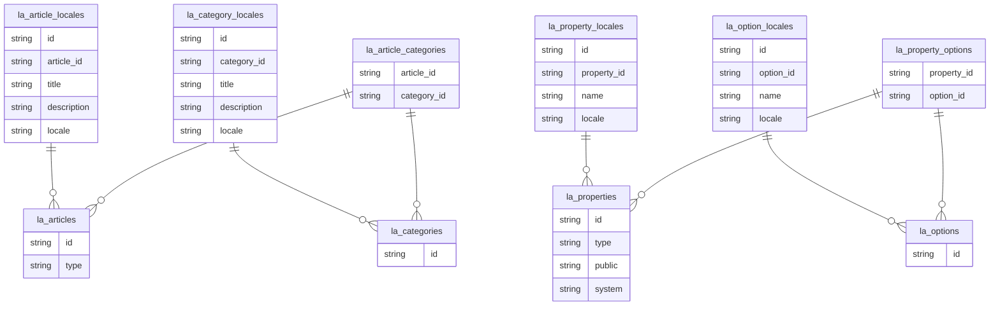

# Article Database Schema

```mermaid
erDiagram
    la_articles {
        string id
        string type
    }
    la_article_locales {
        string id
        string article_id
        string title
        string description
        string locale
    }
    la_categories {
        string id
    }
    la_category_locales {
        string id
        string category_id
        string title
        string description
        string locale
    }
    la_article_categories {
        string article_id
        string category_id
    }
    la_properties {
        string id
        string type
        string public
        string system
    }
    la_property_locales {
        string id
        string property_id
        string name
        string locale
    }
    la_options {
        string id
    }
    la_option_locales {
        string id
        string option_id
        string name
        string locale
    }
    la_property_options {
        string property_id
        string option_id
    }
    la_article_locales ||--o{ la_articles : ""
    la_category_locales ||--o{ la_categories : ""
    la_article_categories ||--o{ la_articles : ""
    la_article_categories ||--o{ la_categories : ""
    la_property_locales ||--o{ la_properties : ""
    la_option_locales ||--o{ la_options : ""
    la_property_options ||--o{ la_properties : ""
    la_property_options ||--o{ la_options : ""

```
