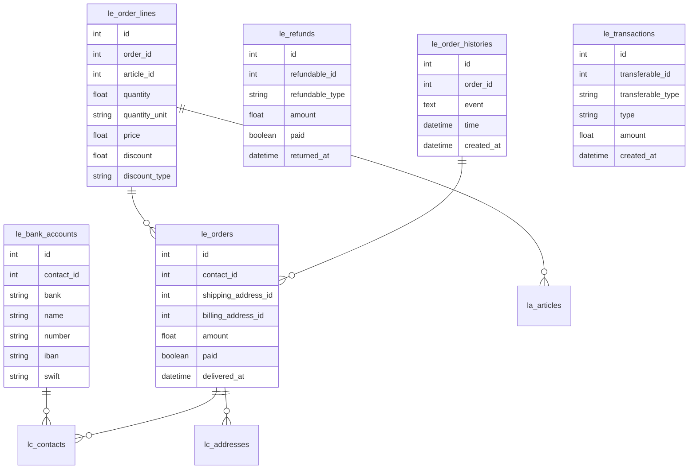

# Lava Commerce Database Schema

```mermaid
erDiagram
    le_bank_accounts {
        int id
        int contact_id
        string bank
        string name
        string number
        string iban
        string swift
    }
    le_orders {
        int id
        int contact_id
        int shipping_address_id
        int billing_address_id
        float amount
        boolean paid
        datetime delivered_at
    }
    le_order_lines {
        int id
        int order_id
        int article_id
        float quantity
        string quantity_unit
        float price
        float discount
        string discount_type
    }
    le_refunds {
        int id
        int refundable_id
        string refundable_type
        float amount
        boolean paid
        datetime returned_at
    }
    le_order_histories {
        int id
        int order_id
        text event
        datetime time
        datetime created_at
    }
    le_transactions {
        int id
        int transferable_id
        string transferable_type
        string type
        float amount
        datetime created_at
    }
    le_bank_accounts ||--o{ lc_contacts : ""
    le_orders ||--o{ lc_contacts : ""
    le_orders ||--o{ lc_addresses : ""
    le_order_lines ||--o{ le_orders : ""
    le_order_lines ||--o{ la_articles : ""
    le_order_histories ||--o{ le_orders : ""

```
