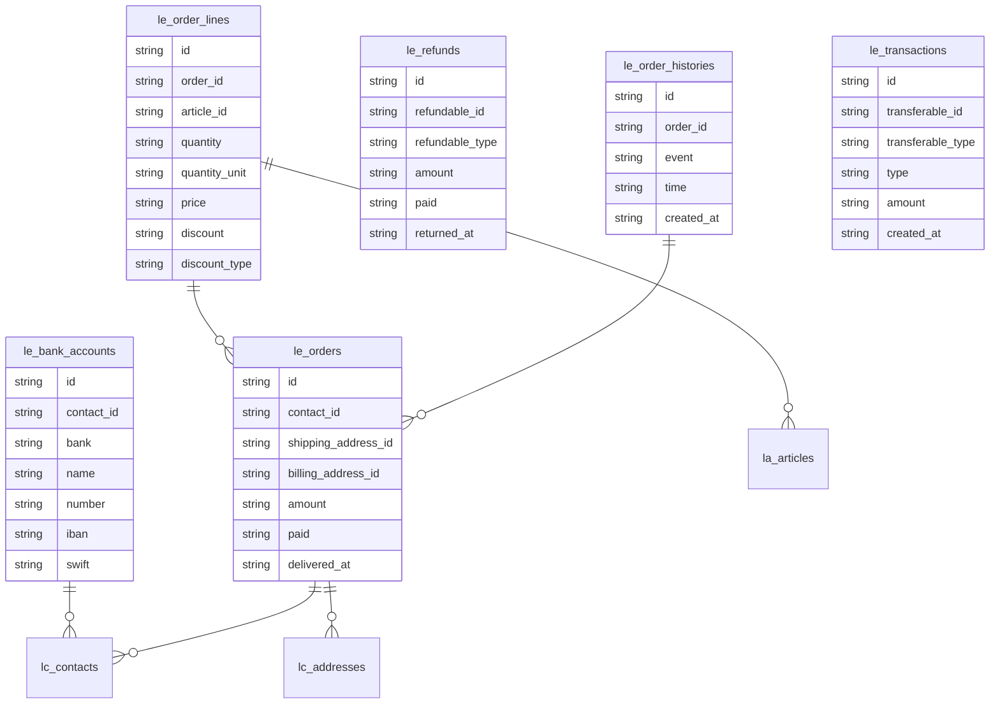

# Commerce Database Schema

```mermaid
erDiagram
    le_bank_accounts {
        string id
        string contact_id
        string bank
        string name
        string number
        string iban
        string swift
    }
    le_orders {
        string id
        string contact_id
        string shipping_address_id
        string billing_address_id
        string amount
        string paid
        string delivered_at
    }
    le_order_lines {
        string id
        string order_id
        string article_id
        string quantity
        string quantity_unit
        string price
        string discount
        string discount_type
    }
    le_refunds {
        string id
        string refundable_id
        string refundable_type
        string amount
        string paid
        string returned_at
    }
    le_order_histories {
        string id
        string order_id
        string event
        string time
        string created_at
    }
    le_transactions {
        string id
        string transferable_id
        string transferable_type
        string type
        string amount
        string created_at
    }
    le_bank_accounts ||--o{ lc_contacts : ""
    le_orders ||--o{ lc_contacts : ""
    le_orders ||--o{ lc_addresses : ""
    le_order_lines ||--o{ le_orders : ""
    le_order_lines ||--o{ la_articles : ""
    le_order_histories ||--o{ le_orders : ""

```
