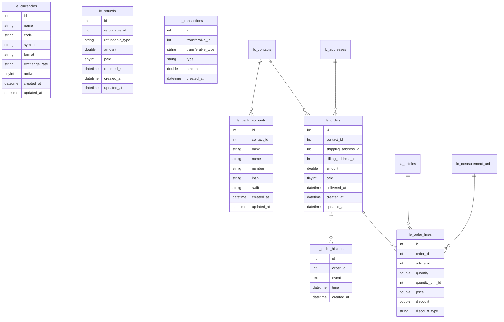

# Lava Commerce Database Schema

```mermaid
erDiagram
    le_bank_accounts {
        int id
        int contact_id
        string bank
        string name
        string number
        string iban
        string swift
        datetime created_at
        datetime updated_at
    }
    le_currencies {
        int id
        string name
        string code
        string symbol
        string format
        string exchange_rate
        tinyint active
        datetime created_at
        datetime updated_at
    }
    le_order_histories {
        int id
        int order_id
        text event
        datetime time
        datetime created_at
    }
    le_order_lines {
        int id
        int order_id
        int article_id
        double quantity
        int quantity_unit_id
        double price
        double discount
        string discount_type
    }
    le_orders {
        int id
        int contact_id
        int shipping_address_id
        int billing_address_id
        double amount
        tinyint paid
        datetime delivered_at
        datetime created_at
        datetime updated_at
    }
    le_refunds {
        int id
        int refundable_id
        string refundable_type
        double amount
        tinyint paid
        datetime returned_at
        datetime created_at
        datetime updated_at
    }
    le_transactions {
        int id
        int transferable_id
        string transferable_type
        string type
        double amount
        datetime created_at
    }
    lc_contacts ||--o{ le_bank_accounts : ""
    le_orders ||--o{ le_order_histories : ""
    la_articles ||--o{ le_order_lines : ""
    le_orders ||--o{ le_order_lines : ""
    lc_measurement_units ||--o{ le_order_lines : ""
    lc_addresses ||--o{ le_orders : ""
    lc_contacts ||--o{ le_orders : ""

```
