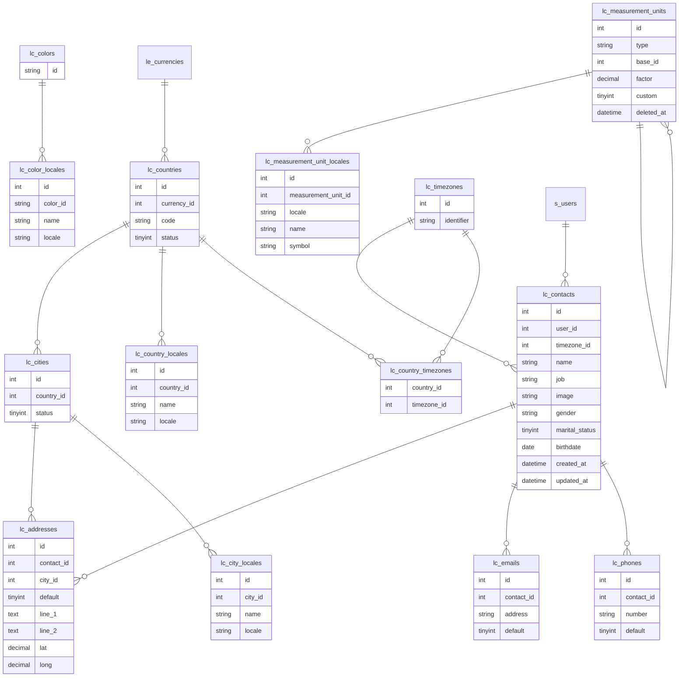

# Lava Common Database Schema

```mermaid
erDiagram
    lc_addresses {
        int id
        int contact_id
        int city_id
        tinyint default
        text line_1
        text line_2
        decimal lat
        decimal long
    }
    lc_cities {
        int id
        int country_id
        tinyint status
    }
    lc_city_locales {
        int id
        int city_id
        string name
        string locale
    }
    lc_color_locales {
        int id
        string color_id
        string name
        string locale
    }
    lc_colors {
        string id
    }
    lc_contacts {
        int id
        int user_id
        int timezone_id
        string name
        string job
        string image
        string gender
        tinyint marital_status
        date birthdate
        datetime created_at
        datetime updated_at
    }
    lc_countries {
        int id
        int currency_id
        string code
        tinyint status
    }
    lc_country_locales {
        int id
        int country_id
        string name
        string locale
    }
    lc_country_timezones {
        int country_id
        int timezone_id
    }
    lc_emails {
        int id
        int contact_id
        string address
        tinyint default
    }
    lc_measurement_unit_locales {
        int id
        int measurement_unit_id
        string locale
        string name
        string symbol
    }
    lc_measurement_units {
        int id
        string type
        int base_id
        decimal factor
        tinyint custom
        datetime deleted_at
    }
    lc_phones {
        int id
        int contact_id
        string number
        tinyint default
    }
    lc_timezones {
        int id
        string identifier
    }
    lc_cities ||--o{ lc_addresses : ""
    lc_contacts ||--o{ lc_addresses : ""
    lc_countries ||--o{ lc_cities : ""
    lc_cities ||--o{ lc_city_locales : ""
    lc_colors ||--o{ lc_color_locales : ""
    lc_timezones ||--o{ lc_contacts : ""
    s_users ||--o{ lc_contacts : ""
    le_currencies ||--o{ lc_countries : ""
    lc_countries ||--o{ lc_country_locales : ""
    lc_countries ||--o{ lc_country_timezones : ""
    lc_timezones ||--o{ lc_country_timezones : ""
    lc_contacts ||--o{ lc_emails : ""
    lc_measurement_units ||--o{ lc_measurement_unit_locales : ""
    lc_measurement_units ||--o{ lc_measurement_units : ""
    lc_contacts ||--o{ lc_phones : ""

```
