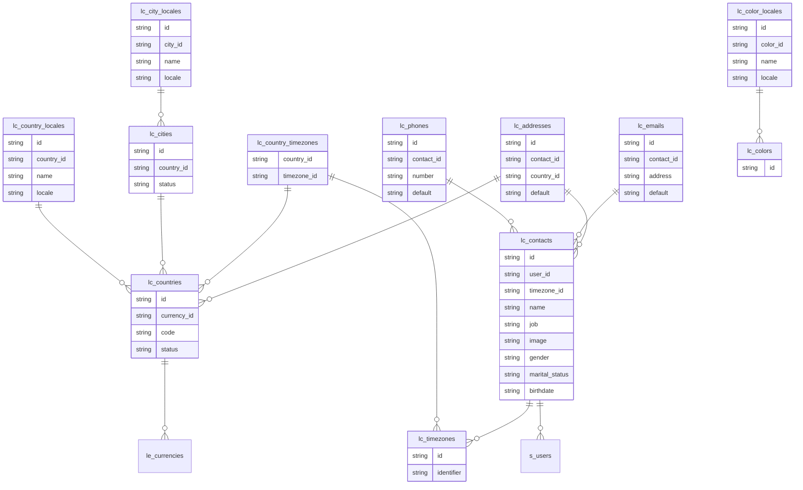

# Common Database Schema

```mermaid
erDiagram
    lc_countries {
        string id
        string currency_id
        string code
        string status
    }
    lc_country_locales {
        string id
        string country_id
        string name
        string locale
    }
    lc_cities {
        string id
        string country_id
        string status
    }
    lc_city_locales {
        string id
        string city_id
        string name
        string locale
    }
    lc_timezones {
        string id
        string identifier
    }
    lc_country_timezones {
        string country_id
        string timezone_id
    }
    lc_contacts {
        string id
        string user_id
        string timezone_id
        string name
        string job
        string image
        string gender
        string marital_status
        string birthdate
    }
    lc_phones {
        string id
        string contact_id
        string number
        string default
    }
    lc_emails {
        string id
        string contact_id
        string address
        string default
    }
    lc_addresses {
        string id
        string contact_id
        string country_id
        string default
    }
    lc_colors {
        string id
    }
    lc_color_locales {
        string id
        string color_id
        string name
        string locale
    }
    lc_countries ||--o{ le_currencies : ""
    lc_country_locales ||--o{ lc_countries : ""
    lc_cities ||--o{ lc_countries : ""
    lc_city_locales ||--o{ lc_cities : ""
    lc_country_timezones ||--o{ lc_countries : ""
    lc_country_timezones ||--o{ lc_timezones : ""
    lc_contacts ||--o{ s_users : ""
    lc_contacts ||--o{ lc_timezones : ""
    lc_phones ||--o{ lc_contacts : ""
    lc_emails ||--o{ lc_contacts : ""
    lc_addresses ||--o{ lc_contacts : ""
    lc_addresses ||--o{ lc_countries : ""
    lc_color_locales ||--o{ lc_colors : ""

```
