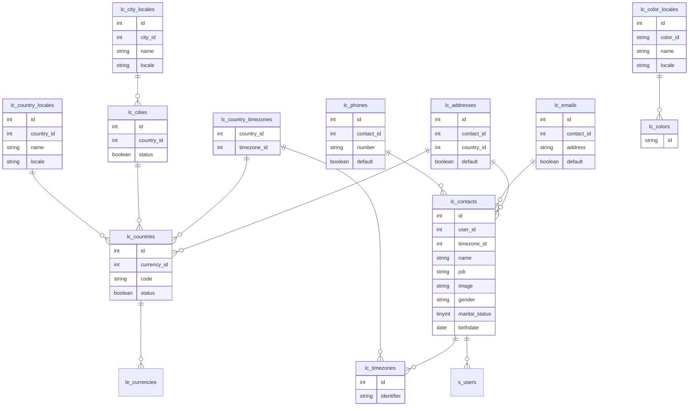

# Lava Common Database Schema

```mermaid
erDiagram
    lc_countries {
        int id
        int currency_id
        string code
        boolean status
    }
    lc_country_locales {
        int id
        int country_id
        string name
        string locale
    }
    lc_cities {
        int id
        int country_id
        boolean status
    }
    lc_city_locales {
        int id
        int city_id
        string name
        string locale
    }
    lc_timezones {
        int id
        string identifier
    }
    lc_country_timezones {
        int country_id
        int timezone_id
    }
    lc_contacts {
        int id
        int user_id
        int timezone_id
        string name
        string job
        string image
        string gender
        tinyint marital_status
        date birthdate
    }
    lc_phones {
        int id
        int contact_id
        string number
        boolean default
    }
    lc_emails {
        int id
        int contact_id
        string address
        boolean default
    }
    lc_addresses {
        int id
        int contact_id
        int country_id
        boolean default
    }
    lc_colors {
        string id
    }
    lc_color_locales {
        int id
        string color_id
        string name
        string locale
    }
    lc_countries ||--o{ le_currencies : ""
    lc_country_locales ||--o{ lc_countries : ""
    lc_cities ||--o{ lc_countries : ""
    lc_city_locales ||--o{ lc_cities : ""
    lc_country_timezones ||--o{ lc_countries : ""
    lc_country_timezones ||--o{ lc_timezones : ""
    lc_contacts ||--o{ s_users : ""
    lc_contacts ||--o{ lc_timezones : ""
    lc_phones ||--o{ lc_contacts : ""
    lc_emails ||--o{ lc_contacts : ""
    lc_addresses ||--o{ lc_contacts : ""
    lc_addresses ||--o{ lc_countries : ""
    lc_color_locales ||--o{ lc_colors : ""

```
