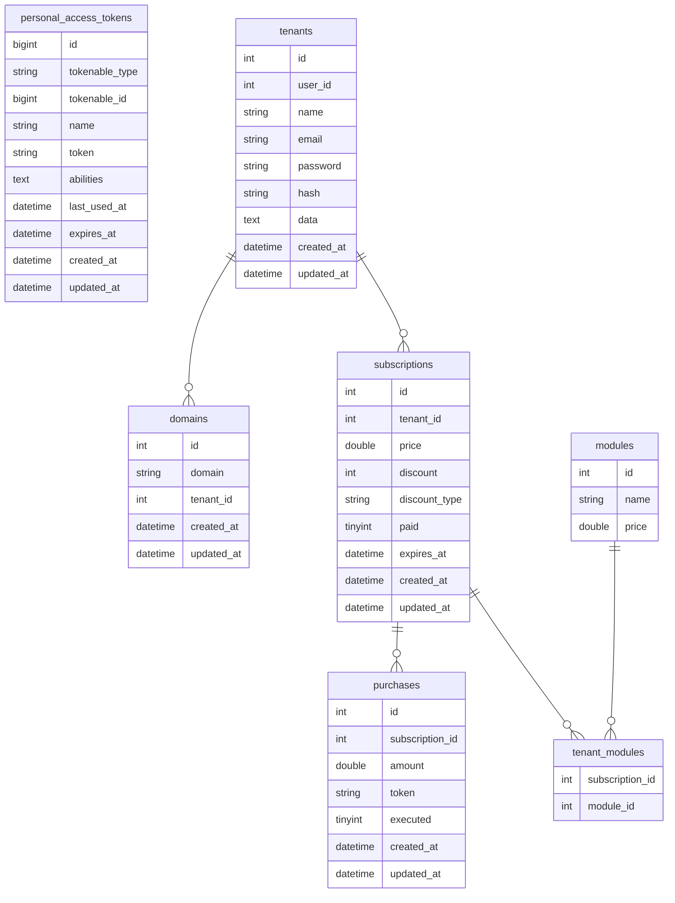

# Core Database Schema

```mermaid
erDiagram
    domains {
        int id
        string domain
        int tenant_id
        datetime created_at
        datetime updated_at
    }
    modules {
        int id
        string name
        double price
    }
    personal_access_tokens {
        bigint id
        string tokenable_type
        bigint tokenable_id
        string name
        string token
        text abilities
        datetime last_used_at
        datetime expires_at
        datetime created_at
        datetime updated_at
    }
    purchases {
        int id
        int subscription_id
        double amount
        string token
        tinyint executed
        datetime created_at
        datetime updated_at
    }
    subscriptions {
        int id
        int tenant_id
        double price
        int discount
        string discount_type
        tinyint paid
        datetime expires_at
        datetime created_at
        datetime updated_at
    }
    tenant_modules {
        int subscription_id
        int module_id
    }
    tenants {
        int id
        int user_id
        string name
        string email
        string password
        string hash
        text data
        datetime created_at
        datetime updated_at
    }
    tenants ||--o{ domains : ""
    subscriptions ||--o{ purchases : ""
    tenants ||--o{ subscriptions : ""
    modules ||--o{ tenant_modules : ""
    subscriptions ||--o{ tenant_modules : ""

```
