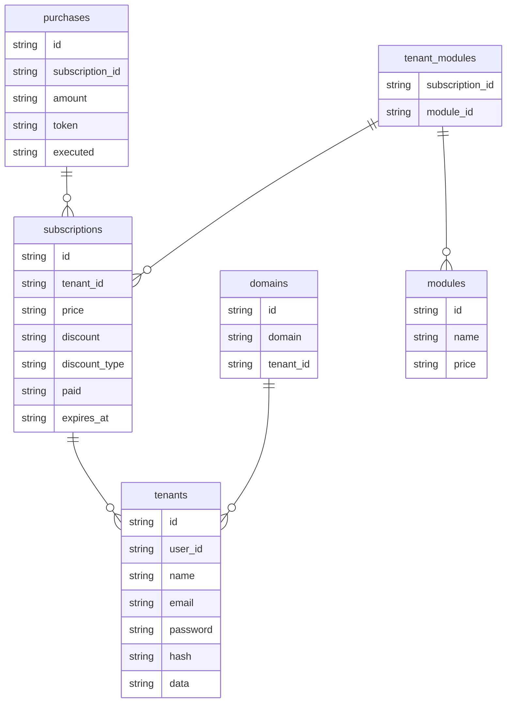

# Core Database Schema

```mermaid
erDiagram
    tenants {
        string id
        string user_id
        string name
        string email
        string password
        string hash
        string data
    }
    domains {
        string id
        string domain
        string tenant_id
    }
    subscriptions {
        string id
        string tenant_id
        string price
        string discount
        string discount_type
        string paid
        string expires_at
    }
    modules {
        string id
        string name
        string price
    }
    tenant_modules {
        string subscription_id
        string module_id
    }
    purchases {
        string id
        string subscription_id
        string amount
        string token
        string executed
    }
    domains ||--o{ tenants : ""
    subscriptions ||--o{ tenants : ""
    tenant_modules ||--o{ subscriptions : ""
    tenant_modules ||--o{ modules : ""
    purchases ||--o{ subscriptions : ""

```
