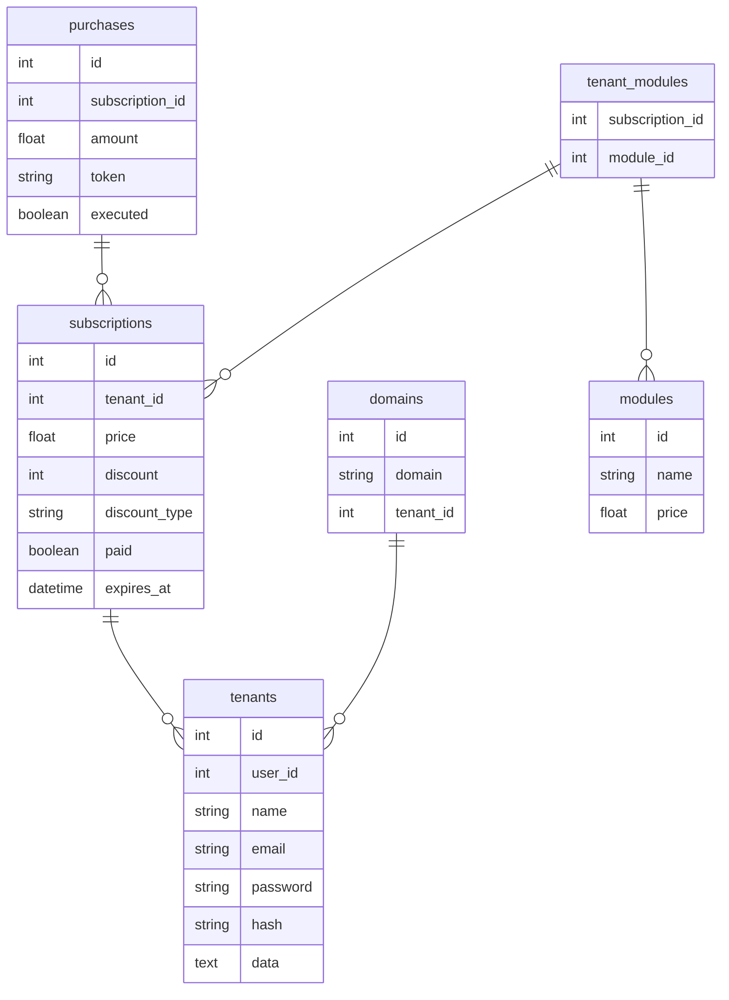

# Core Database Schema

```mermaid
erDiagram
    tenants {
        int id
        int user_id
        string name
        string email
        string password
        string hash
        text data
    }
    domains {
        int id
        string domain
        int tenant_id
    }
    subscriptions {
        int id
        int tenant_id
        float price
        int discount
        string discount_type
        boolean paid
        datetime expires_at
    }
    modules {
        int id
        string name
        float price
    }
    tenant_modules {
        int subscription_id
        int module_id
    }
    purchases {
        int id
        int subscription_id
        float amount
        string token
        boolean executed
    }
    domains ||--o{ tenants : ""
    subscriptions ||--o{ tenants : ""
    tenant_modules ||--o{ subscriptions : ""
    tenant_modules ||--o{ modules : ""
    purchases ||--o{ subscriptions : ""

```
