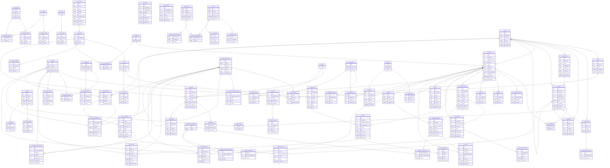

# Complete Database Schema

```mermaid
erDiagram
    a_cart_articles {
        int cart_id
        int article_id
        double quantity
        int quantity_unit_id
    }
    a_carts {
        int id
        int user_id
        string token
        datetime created_at
        datetime updated_at
    }
    e_assignees {
        int contact_id
        int task_id
    }
    e_attachment_versions {
        int id
        int attachment_id
        datetime created_at
    }
    e_attachments {
        int id
        int user_id
        int task_id
        string filename
    }
    e_comments {
        int id
        int task_id
        int user_id
        text content
        datetime created_at
        datetime updated_at
    }
    e_custom_schedules {
        int id
        text working_days
        string start_time
        string end_time
    }
    e_label_locales {
        int id
        int label_id
        string title
        string locale
    }
    e_labels {
        int id
        string function
        tinyint system
        datetime created_at
        datetime updated_at
    }
    e_milestones {
        int id
        int user_id
        string title
        text description
        date starts_at
        date ends_at
        datetime created_at
        datetime updated_at
    }
    e_task_labels {
        int task_id
        int label_id
    }
    e_tasks {
        int id
        int parent_id
        int creator_id
        int milestone_id
        int estimated_time
        string title
        text description
        datetime created_at
        datetime updated_at
    }
    e_workflows {
        int id
        tinyint system
        text label_ids
    }
    la_article_categories {
        int article_id
        int category_id
    }
    la_article_locales {
        int id
        int article_id
        string title
        text description
        string locale
    }
    la_articles {
        int id
        tinyint type
        datetime created_at
        datetime updated_at
    }
    la_categories {
        int id
        datetime created_at
        datetime updated_at
    }
    la_category_locales {
        int id
        int category_id
        string title
        text description
        string locale
    }
    la_option_locales {
        int id
        int option_id
        string name
        string locale
    }
    la_options {
        int id
    }
    la_properties {
        int id
        tinyint type
        tinyint public
        tinyint system
    }
    la_property_locales {
        int id
        int property_id
        string name
        string locale
    }
    la_property_options {
        int property_id
        int option_id
    }
    lc_addresses {
        int id
        int contact_id
        int city_id
        tinyint default
        text line_1
        text line_2
        decimal lat
        decimal long
    }
    lc_cities {
        int id
        int country_id
        tinyint status
    }
    lc_city_locales {
        int id
        int city_id
        string name
        string locale
    }
    lc_color_locales {
        int id
        string color_id
        string name
        string locale
    }
    lc_colors {
        string id
    }
    lc_contacts {
        int id
        int user_id
        int timezone_id
        string name
        string job
        string image
        string gender
        tinyint marital_status
        date birthdate
        datetime created_at
        datetime updated_at
    }
    lc_countries {
        int id
        int currency_id
        string code
        tinyint status
    }
    lc_country_locales {
        int id
        int country_id
        string name
        string locale
    }
    lc_country_timezones {
        int country_id
        int timezone_id
    }
    lc_emails {
        int id
        int contact_id
        string address
        tinyint default
    }
    lc_measurement_unit_locales {
        int id
        int measurement_unit_id
        string locale
        string name
        string symbol
    }
    lc_measurement_units {
        int id
        string type
        int base_id
        decimal factor
        tinyint custom
        datetime deleted_at
    }
    lc_phones {
        int id
        int contact_id
        string number
        tinyint default
    }
    lc_timezones {
        int id
        string identifier
    }
    le_bank_accounts {
        int id
        int contact_id
        string bank
        string name
        string number
        string iban
        string swift
        datetime created_at
        datetime updated_at
    }
    le_currencies {
        int id
        string name
        string code
        string symbol
        string format
        string exchange_rate
        tinyint active
        datetime created_at
        datetime updated_at
    }
    le_order_histories {
        int id
        int order_id
        text event
        datetime time
        datetime created_at
    }
    le_order_lines {
        int id
        int order_id
        int article_id
        double quantity
        int quantity_unit_id
        double price
        double discount
        string discount_type
    }
    le_orders {
        int id
        int contact_id
        int shipping_address_id
        int billing_address_id
        double amount
        tinyint paid
        datetime delivered_at
        datetime created_at
        datetime updated_at
    }
    le_refunds {
        int id
        int refundable_id
        string refundable_type
        double amount
        tinyint paid
        datetime returned_at
        datetime created_at
        datetime updated_at
    }
    le_transactions {
        int id
        int transferable_id
        string transferable_type
        string type
        double amount
        datetime created_at
    }
    o_execution_consumptions {
        int id
        int plan_execution_id
        int article_id
        double quantity
        int quantity_unit_id
        datetime created_at
        datetime updated_at
    }
    o_execution_logs {
        int id
        int user_id
        int plan_execution_id
        tinyint status
        text note
        datetime created_at
    }
    o_plan_consumptions {
        int id
        int product_plan_id
        int article_id
        double quantity
        int quantity_unit_id
        datetime created_at
        datetime updated_at
    }
    o_plan_executions {
        int id
        int user_id
        int product_plan_id
        string plan_log_id
        tinyint status
        text note
        datetime created_at
        datetime updated_at
    }
    o_product_plans {
        int id
        int user_id
        int article_id
        double quantity
        int quantity_unit_id
    }
    o_purchase_histories {
        int id
        int purchase_id
        text event
        datetime time
        datetime created_at
    }
    o_purchase_lines {
        int id
        int purchase_id
        int article_id
        double quantity
        int quantity_unit_id
        double price
    }
    o_purchases {
        int id
        int contact_id
        int bank_account_id
        double amount
        tinyint paid
        datetime received_at
        datetime created_at
        datetime updated_at
    }
    r_applicables {
        int applicant_id
        string applicable_type
        bigint applicable_id
    }
    r_applicants {
        int id
        int country_id
        int degree_id
        int degree_date
        tinyint tenure
        datetime recruited_at
        datetime created_at
        datetime updated_at
    }
    r_contact_shifts {
        int contact_id
        int shift_id
        tinyint weekday
    }
    r_degree_locales {
        int id
        int degree_id
        string locale
        string name
    }
    r_degrees {
        int id
    }
    r_department_locales {
        int id
        int department_id
        string locale
        string name
    }
    r_departments {
        int id
        datetime created_at
        datetime updated_at
    }
    r_documents {
        int id
        int applicant_id
        string title
        string filename
        datetime created_at
        datetime updated_at
    }
    r_leaves {
        int id
        int contact_id
        string type
        tinyint status
        date starts_at
        date ends_at
        datetime created_at
        datetime updated_at
    }
    r_notices {
        int id
        int author_id
        int contact_id
        int payroll_payment_id
        string type
        text content
        datetime created_at
        datetime updated_at
    }
    r_payment_components {
        int payroll_payment_id
        int payroll_component_id
        double amount
    }
    r_payroll_component_locales {
        int id
        int payroll_component_id
        string title
        string locale
    }
    r_payroll_components {
        int id
        string type
    }
    r_payroll_payments {
        int id
        int salary_id
        int bank_account_id
        tinyint units
        datetime paid_at
        datetime created_at
        datetime updated_at
    }
    r_punches {
        bigint id
        int contact_id
        int shift_id
        string type
        smallint latency
        datetime created_at
    }
    r_salaries {
        int id
        string type
        datetime created_at
        datetime updated_at
    }
    r_salary_components {
        int salary_id
        int payroll_component_id
        double amount
    }
    r_shifts {
        int id
        string start
        string end
    }
    r_subordinates {
        string id
        int manager_id
        int contact_id
        int department_id
    }
    r_vacancies {
        int id
        int department_id
        tinyint active
        datetime created_at
        datetime updated_at
    }
    r_vacancy_locales {
        int id
        int vacancy_id
        string locale
        string title
        text description
    }
    s_model_has_permissions {
        bigint permission_id
        string model_type
        bigint model_id
    }
    s_model_has_roles {
        bigint role_id
        string model_type
        bigint model_id
    }
    s_permissions {
        bigint id
        string name
        string guard_name
        datetime created_at
        datetime updated_at
    }
    s_role_has_permissions {
        bigint permission_id
        bigint role_id
    }
    s_role_locales {
        bigint id
        bigint role_id
        string title
        string locale
    }
    s_roles {
        bigint id
        string name
        string guard_name
        datetime created_at
        datetime updated_at
    }
    s_users {
        int id
        string username
        string password
        string image
        datetime created_at
        datetime updated_at
    }
    la_articles ||--o{ a_cart_articles : ""
    a_carts ||--o{ a_cart_articles : ""
    lc_measurement_units ||--o{ a_cart_articles : ""
    s_users ||--o{ a_carts : ""
    lc_contacts ||--o{ e_assignees : ""
    e_tasks ||--o{ e_assignees : ""
    e_attachments ||--o{ e_attachment_versions : ""
    e_tasks ||--o{ e_attachments : ""
    s_users ||--o{ e_attachments : ""
    e_tasks ||--o{ e_comments : ""
    s_users ||--o{ e_comments : ""
    lc_contacts ||--o{ e_custom_schedules : ""
    e_labels ||--o{ e_label_locales : ""
    s_users ||--o{ e_milestones : ""
    e_labels ||--o{ e_task_labels : ""
    e_tasks ||--o{ e_task_labels : ""
    s_users ||--o{ e_tasks : ""
    e_milestones ||--o{ e_tasks : ""
    e_tasks ||--o{ e_tasks : ""
    e_labels ||--o{ e_workflows : ""
    la_articles ||--o{ la_article_categories : ""
    la_categories ||--o{ la_article_categories : ""
    la_articles ||--o{ la_article_locales : ""
    la_categories ||--o{ la_category_locales : ""
    la_options ||--o{ la_option_locales : ""
    la_properties ||--o{ la_property_locales : ""
    la_options ||--o{ la_property_options : ""
    la_properties ||--o{ la_property_options : ""
    lc_cities ||--o{ lc_addresses : ""
    lc_contacts ||--o{ lc_addresses : ""
    lc_countries ||--o{ lc_cities : ""
    lc_cities ||--o{ lc_city_locales : ""
    lc_colors ||--o{ lc_color_locales : ""
    lc_timezones ||--o{ lc_contacts : ""
    s_users ||--o{ lc_contacts : ""
    le_currencies ||--o{ lc_countries : ""
    lc_countries ||--o{ lc_country_locales : ""
    lc_countries ||--o{ lc_country_timezones : ""
    lc_timezones ||--o{ lc_country_timezones : ""
    lc_contacts ||--o{ lc_emails : ""
    lc_measurement_units ||--o{ lc_measurement_unit_locales : ""
    lc_measurement_units ||--o{ lc_measurement_units : ""
    lc_contacts ||--o{ lc_phones : ""
    lc_contacts ||--o{ le_bank_accounts : ""
    le_orders ||--o{ le_order_histories : ""
    la_articles ||--o{ le_order_lines : ""
    le_orders ||--o{ le_order_lines : ""
    lc_measurement_units ||--o{ le_order_lines : ""
    lc_addresses ||--o{ le_orders : ""
    lc_contacts ||--o{ le_orders : ""
    la_articles ||--o{ o_execution_consumptions : ""
    o_plan_executions ||--o{ o_execution_consumptions : ""
    lc_measurement_units ||--o{ o_execution_consumptions : ""
    o_plan_executions ||--o{ o_execution_logs : ""
    s_users ||--o{ o_execution_logs : ""
    la_articles ||--o{ o_plan_consumptions : ""
    o_product_plans ||--o{ o_plan_consumptions : ""
    lc_measurement_units ||--o{ o_plan_consumptions : ""
    o_product_plans ||--o{ o_plan_executions : ""
    s_users ||--o{ o_plan_executions : ""
    la_articles ||--o{ o_product_plans : ""
    lc_measurement_units ||--o{ o_product_plans : ""
    s_users ||--o{ o_product_plans : ""
    o_purchases ||--o{ o_purchase_histories : ""
    la_articles ||--o{ o_purchase_lines : ""
    o_purchases ||--o{ o_purchase_lines : ""
    lc_measurement_units ||--o{ o_purchase_lines : ""
    le_bank_accounts ||--o{ o_purchases : ""
    lc_contacts ||--o{ o_purchases : ""
    r_applicants ||--o{ r_applicables : ""
    lc_countries ||--o{ r_applicants : ""
    r_degrees ||--o{ r_applicants : ""
    lc_contacts ||--o{ r_applicants : ""
    lc_contacts ||--o{ r_contact_shifts : ""
    r_shifts ||--o{ r_contact_shifts : ""
    r_degrees ||--o{ r_degree_locales : ""
    r_departments ||--o{ r_department_locales : ""
    r_applicants ||--o{ r_documents : ""
    lc_contacts ||--o{ r_leaves : ""
    lc_contacts ||--o{ r_notices : ""
    r_payroll_payments ||--o{ r_notices : ""
    r_payroll_components ||--o{ r_payment_components : ""
    r_payroll_payments ||--o{ r_payment_components : ""
    r_payroll_components ||--o{ r_payroll_component_locales : ""
    le_bank_accounts ||--o{ r_payroll_payments : ""
    r_salaries ||--o{ r_payroll_payments : ""
    r_shifts ||--o{ r_punches : ""
    lc_contacts ||--o{ r_punches : ""
    lc_contacts ||--o{ r_salaries : ""
    r_payroll_components ||--o{ r_salary_components : ""
    r_salaries ||--o{ r_salary_components : ""
    lc_contacts ||--o{ r_subordinates : ""
    r_departments ||--o{ r_subordinates : ""
    r_departments ||--o{ r_vacancies : ""
    r_vacancies ||--o{ r_vacancy_locales : ""
    s_permissions ||--o{ s_model_has_permissions : ""
    s_roles ||--o{ s_model_has_roles : ""
    s_permissions ||--o{ s_role_has_permissions : ""
    s_roles ||--o{ s_role_has_permissions : ""
    s_roles ||--o{ s_role_locales : ""

```
