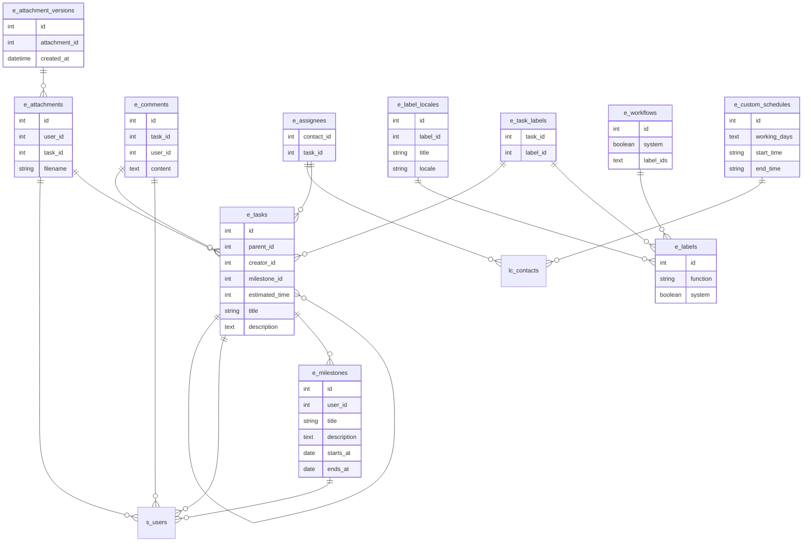

# Emerald Database Schema

```mermaid
erDiagram
    e_milestones {
        int id
        int user_id
        string title
        text description
        date starts_at
        date ends_at
    }
    e_tasks {
        int id
        int parent_id
        int creator_id
        int milestone_id
        int estimated_time
        string title
        text description
    }
    e_attachments {
        int id
        int user_id
        int task_id
        string filename
    }
    e_attachment_versions {
        int id
        int attachment_id
        datetime created_at
    }
    e_comments {
        int id
        int task_id
        int user_id
        text content
    }
    e_assignees {
        int contact_id
        int task_id
    }
    e_labels {
        int id
        string function
        boolean system
    }
    e_label_locales {
        int id
        int label_id
        string title
        string locale
    }
    e_task_labels {
        int task_id
        int label_id
    }
    e_workflows {
        int id
        boolean system
        text label_ids
    }
    e_custom_schedules {
        int id
        text working_days
        string start_time
        string end_time
    }
    e_milestones ||--o{ s_users : ""
    e_tasks ||--o{ e_tasks : ""
    e_tasks ||--o{ s_users : ""
    e_tasks ||--o{ e_milestones : ""
    e_attachments ||--o{ s_users : ""
    e_attachments ||--o{ e_tasks : ""
    e_attachment_versions ||--o{ e_attachments : ""
    e_comments ||--o{ e_tasks : ""
    e_comments ||--o{ s_users : ""
    e_assignees ||--o{ lc_contacts : ""
    e_assignees ||--o{ e_tasks : ""
    e_label_locales ||--o{ e_labels : ""
    e_task_labels ||--o{ e_tasks : ""
    e_task_labels ||--o{ e_labels : ""
    e_workflows ||--o{ e_labels : ""
    e_custom_schedules ||--o{ lc_contacts : ""

```
