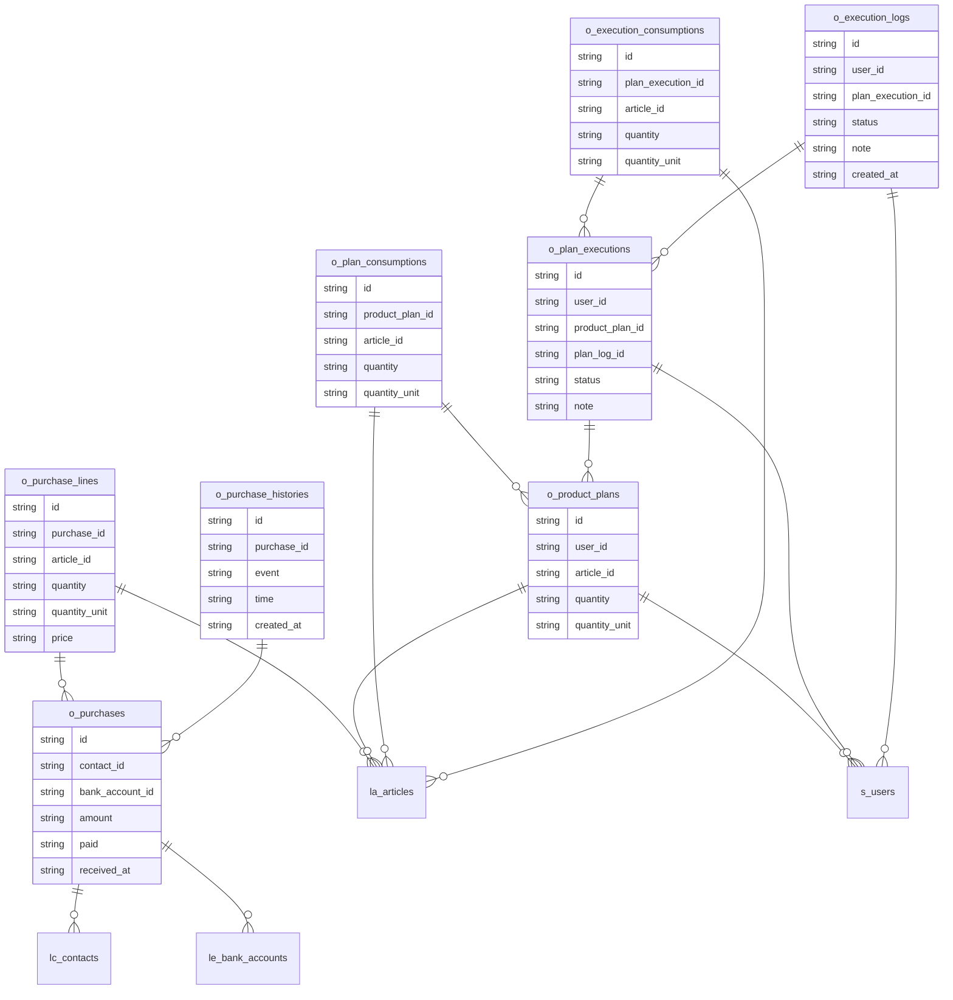

# Onyx Database Schema

```mermaid
erDiagram
    o_purchases {
        string id
        string contact_id
        string bank_account_id
        string amount
        string paid
        string received_at
    }
    o_purchase_lines {
        string id
        string purchase_id
        string article_id
        string quantity
        string quantity_unit
        string price
    }
    o_purchase_histories {
        string id
        string purchase_id
        string event
        string time
        string created_at
    }
    o_product_plans {
        string id
        string user_id
        string article_id
        string quantity
        string quantity_unit
    }
    o_plan_consumptions {
        string id
        string product_plan_id
        string article_id
        string quantity
        string quantity_unit
    }
    o_plan_executions {
        string id
        string user_id
        string product_plan_id
        string plan_log_id
        string status
        string note
    }
    o_execution_consumptions {
        string id
        string plan_execution_id
        string article_id
        string quantity
        string quantity_unit
    }
    o_execution_logs {
        string id
        string user_id
        string plan_execution_id
        string status
        string note
        string created_at
    }
    o_purchases ||--o{ lc_contacts : ""
    o_purchases ||--o{ le_bank_accounts : ""
    o_purchase_lines ||--o{ o_purchases : ""
    o_purchase_lines ||--o{ la_articles : ""
    o_purchase_histories ||--o{ o_purchases : ""
    o_product_plans ||--o{ s_users : ""
    o_product_plans ||--o{ la_articles : ""
    o_plan_consumptions ||--o{ o_product_plans : ""
    o_plan_consumptions ||--o{ la_articles : ""
    o_plan_executions ||--o{ s_users : ""
    o_plan_executions ||--o{ o_product_plans : ""
    o_execution_consumptions ||--o{ o_plan_executions : ""
    o_execution_consumptions ||--o{ la_articles : ""
    o_execution_logs ||--o{ s_users : ""
    o_execution_logs ||--o{ o_plan_executions : ""

```
