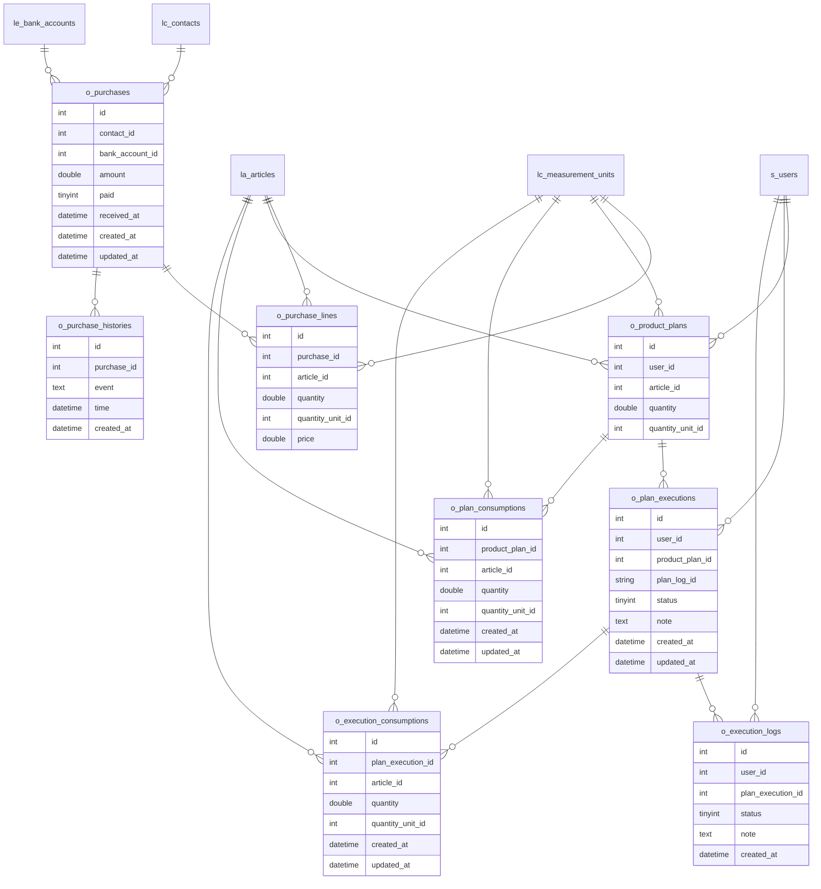

# Onyx Database Schema

```mermaid
erDiagram
    o_execution_consumptions {
        int id
        int plan_execution_id
        int article_id
        double quantity
        int quantity_unit_id
        datetime created_at
        datetime updated_at
    }
    o_execution_logs {
        int id
        int user_id
        int plan_execution_id
        tinyint status
        text note
        datetime created_at
    }
    o_plan_consumptions {
        int id
        int product_plan_id
        int article_id
        double quantity
        int quantity_unit_id
        datetime created_at
        datetime updated_at
    }
    o_plan_executions {
        int id
        int user_id
        int product_plan_id
        string plan_log_id
        tinyint status
        text note
        datetime created_at
        datetime updated_at
    }
    o_product_plans {
        int id
        int user_id
        int article_id
        double quantity
        int quantity_unit_id
    }
    o_purchase_histories {
        int id
        int purchase_id
        text event
        datetime time
        datetime created_at
    }
    o_purchase_lines {
        int id
        int purchase_id
        int article_id
        double quantity
        int quantity_unit_id
        double price
    }
    o_purchases {
        int id
        int contact_id
        int bank_account_id
        double amount
        tinyint paid
        datetime received_at
        datetime created_at
        datetime updated_at
    }
    la_articles ||--o{ o_execution_consumptions : ""
    o_plan_executions ||--o{ o_execution_consumptions : ""
    lc_measurement_units ||--o{ o_execution_consumptions : ""
    o_plan_executions ||--o{ o_execution_logs : ""
    s_users ||--o{ o_execution_logs : ""
    la_articles ||--o{ o_plan_consumptions : ""
    o_product_plans ||--o{ o_plan_consumptions : ""
    lc_measurement_units ||--o{ o_plan_consumptions : ""
    o_product_plans ||--o{ o_plan_executions : ""
    s_users ||--o{ o_plan_executions : ""
    la_articles ||--o{ o_product_plans : ""
    lc_measurement_units ||--o{ o_product_plans : ""
    s_users ||--o{ o_product_plans : ""
    o_purchases ||--o{ o_purchase_histories : ""
    la_articles ||--o{ o_purchase_lines : ""
    o_purchases ||--o{ o_purchase_lines : ""
    lc_measurement_units ||--o{ o_purchase_lines : ""
    le_bank_accounts ||--o{ o_purchases : ""
    lc_contacts ||--o{ o_purchases : ""

```
