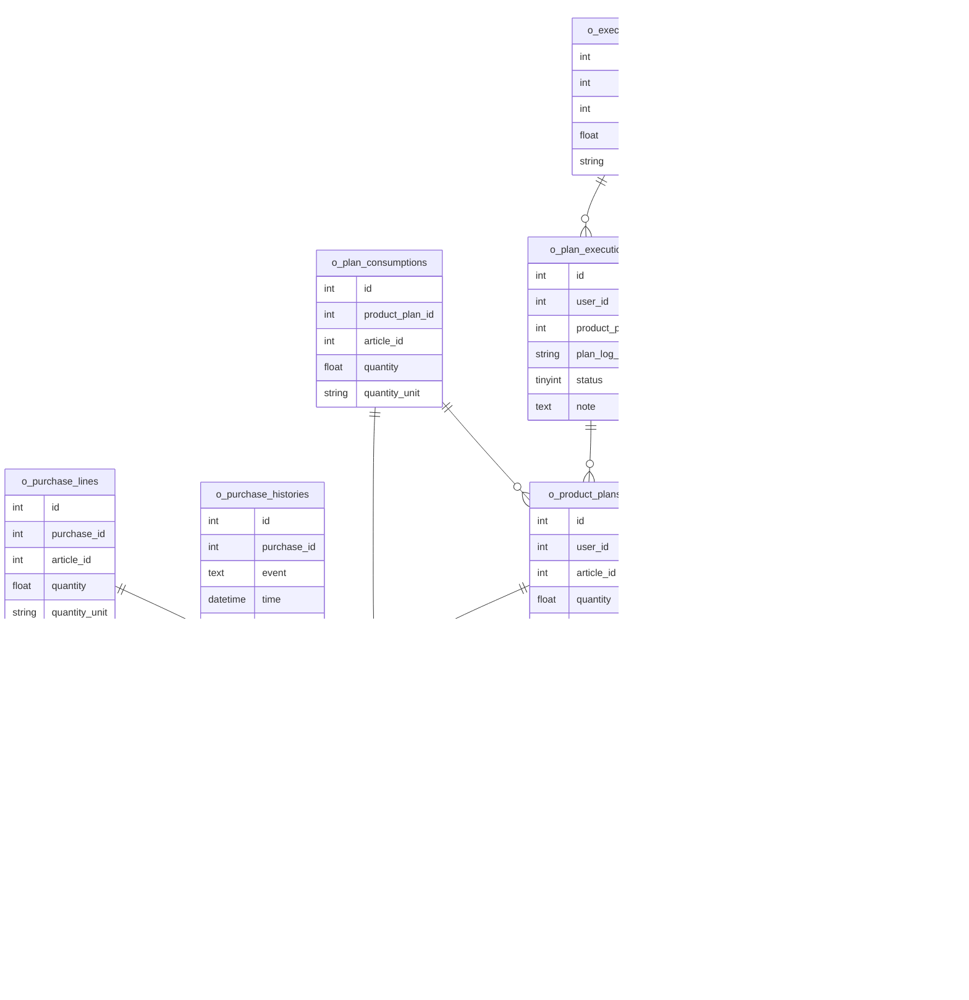

# Onyx Database Schema

```mermaid
erDiagram
    o_purchases {
        int id
        int contact_id
        int bank_account_id
        float amount
        boolean paid
        datetime received_at
    }
    o_purchase_lines {
        int id
        int purchase_id
        int article_id
        float quantity
        string quantity_unit
        float price
    }
    o_purchase_histories {
        int id
        int purchase_id
        text event
        datetime time
        datetime created_at
    }
    o_product_plans {
        int id
        int user_id
        int article_id
        float quantity
        string quantity_unit
    }
    o_plan_consumptions {
        int id
        int product_plan_id
        int article_id
        float quantity
        string quantity_unit
    }
    o_plan_executions {
        int id
        int user_id
        int product_plan_id
        string plan_log_id
        tinyint status
        text note
    }
    o_execution_consumptions {
        int id
        int plan_execution_id
        int article_id
        float quantity
        string quantity_unit
    }
    o_execution_logs {
        int id
        int user_id
        int plan_execution_id
        tinyint status
        text note
        datetime created_at
    }
    o_purchases ||--o{ lc_contacts : ""
    o_purchases ||--o{ le_bank_accounts : ""
    o_purchase_lines ||--o{ o_purchases : ""
    o_purchase_lines ||--o{ la_articles : ""
    o_purchase_histories ||--o{ o_purchases : ""
    o_product_plans ||--o{ s_users : ""
    o_product_plans ||--o{ la_articles : ""
    o_plan_consumptions ||--o{ o_product_plans : ""
    o_plan_consumptions ||--o{ la_articles : ""
    o_plan_executions ||--o{ s_users : ""
    o_plan_executions ||--o{ o_product_plans : ""
    o_execution_consumptions ||--o{ o_plan_executions : ""
    o_execution_consumptions ||--o{ la_articles : ""
    o_execution_logs ||--o{ s_users : ""
    o_execution_logs ||--o{ o_plan_executions : ""

```
