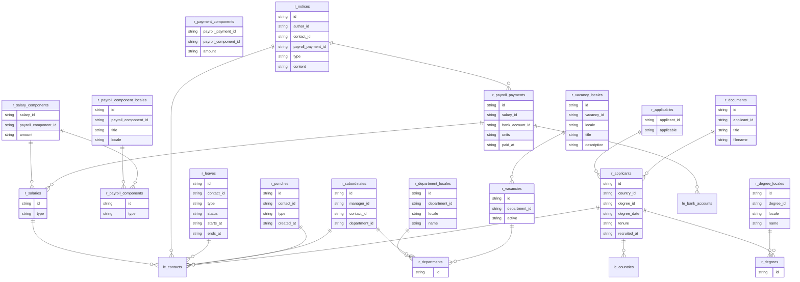

# Ruby Database Schema

```mermaid
erDiagram
    r_salaries {
        string id
        string type
    }
    r_payroll_components {
        string id
        string type
    }
    r_payroll_component_locales {
        string id
        string payroll_component_id
        string title
        string locale
    }
    r_salary_components {
        string salary_id
        string payroll_component_id
        string amount
    }
    r_payroll_payments {
        string id
        string salary_id
        string bank_account_id
        string units
        string paid_at
    }
    r_payment_components {
        string payroll_payment_id
        string payroll_component_id
        string amount
    }
    r_notices {
        string id
        string author_id
        string contact_id
        string payroll_payment_id
        string type
        string content
    }
    r_leaves {
        string id
        string contact_id
        string type
        string status
        string starts_at
        string ends_at
    }
    r_departments {
        string id
    }
    r_department_locales {
        string id
        string department_id
        string locale
        string name
    }
    r_subordinates {
        string id
        string manager_id
        string contact_id
        string department_id
    }
    r_punches {
        string id
        string contact_id
        string type
        string created_at
    }
    r_vacancies {
        string id
        string department_id
        string active
    }
    r_vacancy_locales {
        string id
        string vacancy_id
        string locale
        string title
        string description
    }
    r_degrees {
        string id
    }
    r_degree_locales {
        string id
        string degree_id
        string locale
        string name
    }
    r_applicants {
        string id
        string country_id
        string degree_id
        string degree_date
        string tenure
        string recruited_at
    }
    r_applicables {
        string applicant_id
        string applicable
    }
    r_documents {
        string id
        string applicant_id
        string title
        string filename
    }
    r_salaries ||--o{ lc_contacts : ""
    r_payroll_component_locales ||--o{ r_payroll_components : ""
    r_salary_components ||--o{ r_salaries : ""
    r_salary_components ||--o{ r_payroll_components : ""
    r_payroll_payments ||--o{ r_salaries : ""
    r_payroll_payments ||--o{ le_bank_accounts : ""
    r_notices ||--o{ lc_contacts : ""
    r_notices ||--o{ r_payroll_payments : ""
    r_leaves ||--o{ lc_contacts : ""
    r_department_locales ||--o{ r_departments : ""
    r_subordinates ||--o{ lc_contacts : ""
    r_subordinates ||--o{ r_departments : ""
    r_punches ||--o{ lc_contacts : ""
    r_vacancies ||--o{ r_departments : ""
    r_vacancy_locales ||--o{ r_vacancies : ""
    r_degree_locales ||--o{ r_degrees : ""
    r_applicants ||--o{ lc_contacts : ""
    r_applicants ||--o{ lc_countries : ""
    r_applicants ||--o{ r_degrees : ""
    r_applicables ||--o{ r_applicants : ""
    r_documents ||--o{ r_applicants : ""

```
