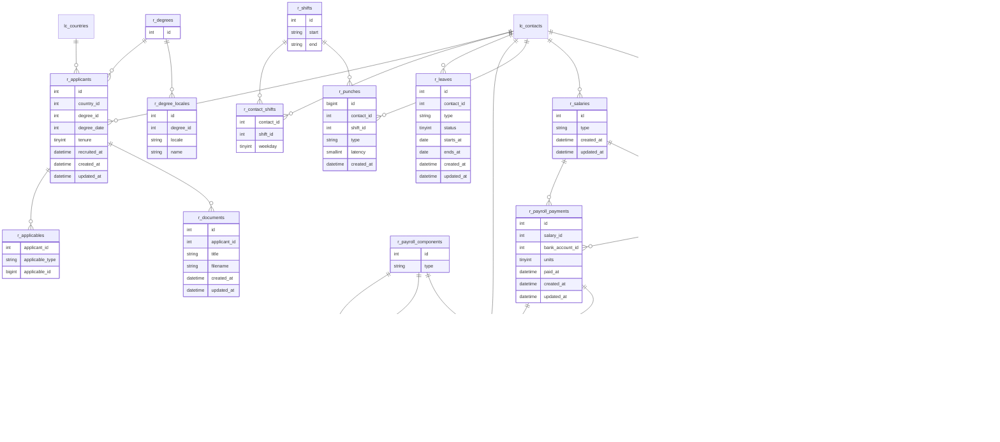

# Ruby Database Schema

```mermaid
erDiagram
    r_applicables {
        int applicant_id
        string applicable_type
        bigint applicable_id
    }
    r_applicants {
        int id
        int country_id
        int degree_id
        int degree_date
        tinyint tenure
        datetime recruited_at
        datetime created_at
        datetime updated_at
    }
    r_contact_shifts {
        int contact_id
        int shift_id
        tinyint weekday
    }
    r_degree_locales {
        int id
        int degree_id
        string locale
        string name
    }
    r_degrees {
        int id
    }
    r_department_locales {
        int id
        int department_id
        string locale
        string name
    }
    r_departments {
        int id
        datetime created_at
        datetime updated_at
    }
    r_documents {
        int id
        int applicant_id
        string title
        string filename
        datetime created_at
        datetime updated_at
    }
    r_leaves {
        int id
        int contact_id
        string type
        tinyint status
        date starts_at
        date ends_at
        datetime created_at
        datetime updated_at
    }
    r_notices {
        int id
        int author_id
        int contact_id
        int payroll_payment_id
        string type
        text content
        datetime created_at
        datetime updated_at
    }
    r_payment_components {
        int payroll_payment_id
        int payroll_component_id
        double amount
    }
    r_payroll_component_locales {
        int id
        int payroll_component_id
        string title
        string locale
    }
    r_payroll_components {
        int id
        string type
    }
    r_payroll_payments {
        int id
        int salary_id
        int bank_account_id
        tinyint units
        datetime paid_at
        datetime created_at
        datetime updated_at
    }
    r_punches {
        bigint id
        int contact_id
        int shift_id
        string type
        smallint latency
        datetime created_at
    }
    r_salaries {
        int id
        string type
        datetime created_at
        datetime updated_at
    }
    r_salary_components {
        int salary_id
        int payroll_component_id
        double amount
    }
    r_shifts {
        int id
        string start
        string end
    }
    r_subordinates {
        string id
        int manager_id
        int contact_id
        int department_id
    }
    r_vacancies {
        int id
        int department_id
        tinyint active
        datetime created_at
        datetime updated_at
    }
    r_vacancy_locales {
        int id
        int vacancy_id
        string locale
        string title
        text description
    }
    r_applicants ||--o{ r_applicables : ""
    lc_countries ||--o{ r_applicants : ""
    r_degrees ||--o{ r_applicants : ""
    lc_contacts ||--o{ r_applicants : ""
    lc_contacts ||--o{ r_contact_shifts : ""
    r_shifts ||--o{ r_contact_shifts : ""
    r_degrees ||--o{ r_degree_locales : ""
    r_departments ||--o{ r_department_locales : ""
    r_applicants ||--o{ r_documents : ""
    lc_contacts ||--o{ r_leaves : ""
    lc_contacts ||--o{ r_notices : ""
    r_payroll_payments ||--o{ r_notices : ""
    r_payroll_components ||--o{ r_payment_components : ""
    r_payroll_payments ||--o{ r_payment_components : ""
    r_payroll_components ||--o{ r_payroll_component_locales : ""
    le_bank_accounts ||--o{ r_payroll_payments : ""
    r_salaries ||--o{ r_payroll_payments : ""
    r_shifts ||--o{ r_punches : ""
    lc_contacts ||--o{ r_punches : ""
    lc_contacts ||--o{ r_salaries : ""
    r_payroll_components ||--o{ r_salary_components : ""
    r_salaries ||--o{ r_salary_components : ""
    lc_contacts ||--o{ r_subordinates : ""
    r_departments ||--o{ r_subordinates : ""
    r_departments ||--o{ r_vacancies : ""
    r_vacancies ||--o{ r_vacancy_locales : ""

```
