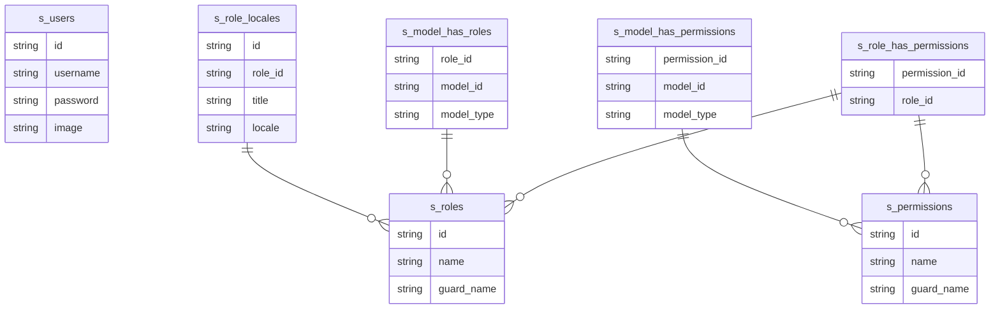

# Sapphire Database Schema

```mermaid
erDiagram
    s_users {
        string id
        string username
        string password
        string image
    }
    s_permissions {
        string id
        string name
        string guard_name
    }
    s_roles {
        string id
        string name
        string guard_name
    }
    s_role_locales {
        string id
        string role_id
        string title
        string locale
    }
    s_model_has_permissions {
        string permission_id
        string model_id
        string model_type
    }
    s_model_has_roles {
        string role_id
        string model_id
        string model_type
    }
    s_role_has_permissions {
        string permission_id
        string role_id
    }
    s_role_locales ||--o{ s_roles : ""
    s_model_has_permissions ||--o{ s_permissions : ""
    s_model_has_roles ||--o{ s_roles : ""
    s_role_has_permissions ||--o{ s_permissions : ""
    s_role_has_permissions ||--o{ s_roles : ""

```
