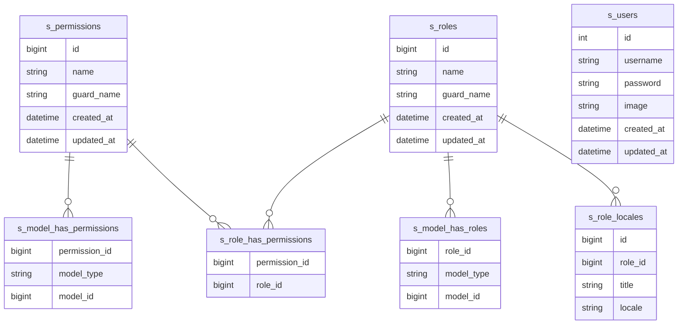

# Sapphire Database Schema

```mermaid
erDiagram
    s_model_has_permissions {
        bigint permission_id
        string model_type
        bigint model_id
    }
    s_model_has_roles {
        bigint role_id
        string model_type
        bigint model_id
    }
    s_permissions {
        bigint id
        string name
        string guard_name
        datetime created_at
        datetime updated_at
    }
    s_role_has_permissions {
        bigint permission_id
        bigint role_id
    }
    s_role_locales {
        bigint id
        bigint role_id
        string title
        string locale
    }
    s_roles {
        bigint id
        string name
        string guard_name
        datetime created_at
        datetime updated_at
    }
    s_users {
        int id
        string username
        string password
        string image
        datetime created_at
        datetime updated_at
    }
    s_permissions ||--o{ s_model_has_permissions : ""
    s_roles ||--o{ s_model_has_roles : ""
    s_permissions ||--o{ s_role_has_permissions : ""
    s_roles ||--o{ s_role_has_permissions : ""
    s_roles ||--o{ s_role_locales : ""

```
